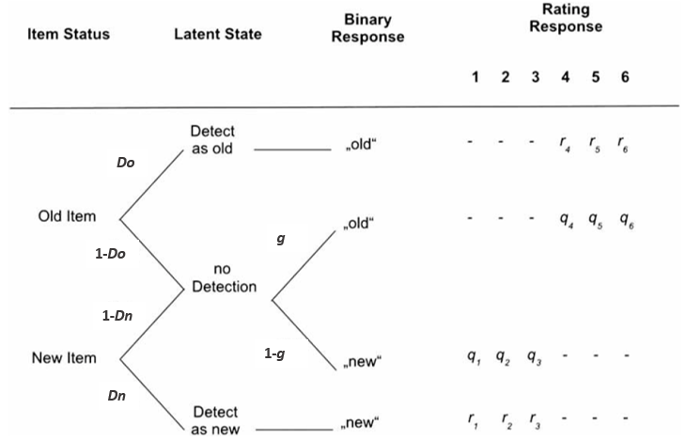

```{r setup, include=FALSE}
options(htmltools.dir.version = FALSE)
# see: https://github.com/yihui/xaringan
# install.packages("xaringan")
# see: 
# https://github.com/yihui/xaringan/wiki
# https://github.com/gnab/remark/wiki/Markdown
options(width=110)
options(digits = 4)
library("tidyr")
library("dplyr")
library("tibble")
library("rlang")
library("reshape2")
library("ggplot2")
library("parallel")
library("MPTinR")
library("TreeBUGS")
library("runjags")
library("purrr")
library("readr")
library("broom") # for tidy
source("../../scripts/auxiliary_functions.R")
source("../../scripts/summary_plots.R")
load("../../broeder_exp1/model_orig.eqn-exp1.txt.RData")
results1 <- results

load("../../broeder_exp1/model_orig_qrest.eqn-exp1.txt.RData")
results2 <- results

load("../../broeder_exp1/model_orig_rrest.eqn-exp1.txt.RData")
results3 <- results
```

class: small

### 2-high threshold model  (2HTM) for 6-point confidence-rating data


- Bröder, Kellen, Schütz, & Rohrmeier (2013, Exp. 1 & 2): Parameter validation studies for 8-point confidence rating.
- Large corpus of 6-point ROC data sets without any manipulation (taken from Klauer & Kellen, 2015, JMP).

---

class: inline-grey
# Bröder, Kellen, Schütz, & Rohrmeier (2013), Experiment 1

- Validation of response mapping parameters, via differently labeled response scales (between-subjects).
- "The aim was to demonstrate the validity of the response mapping function which was added to the 2HTM in order to make it appropriate for the analysis of confidence rating data."
- 68 participants in two groups that differed in wording on 8-point confidence-rating scale:
  1. **'strong wording' condition**:  end categories of scale read 'absolutely sure old/new', which were further emphasized with red exclamation marks
  2. **'weak wording' condition**: end labels read 'pretty sure old/new'
- Learning phase: 120 simple line drawings for 1.5 sec each
- Test phase: 240 items, 120 old and 120 new 

---
class: small



- **Q & R restricted:** q_2 = q_7, q_3 = q_6 & r_3 = r_6 (all but highest confidence response mapping of uncertainty states equated and lowest two confidence response mapping of detection states equated), original restriction used in Bröder et al. (2013).
- **Q restricted:** q_2 = q_7, q_3 = q_6 (all but highest confidence response mapping of uncertainty states equated) 
- **R restricted:** r_3 = r_6 (lowest two confidence response mapping of detection states equated)

---

# Overview Results

1. Model fit
2. Parameter estimates core parameters: $D_o$, $D_n$, $g$
   - estimation methods on $y$-axis
   - restrictions on $y$-axis
3. Differences in core parameters for different naming conditions.
4. Parameter estimates of $q$ parameters (i.e., response mapping in uncertainty states)
4. Differences of $q$ parameters 
5. Parameter estimates of $r$ parameters (i.e., response mapping in certainty states)
5. Differences of $r$ parameters


---

class: small, center

```{r, echo = FALSE, warning=FALSE, fig.width=11, fig.height=6.5, dpi = 500, message=FALSE}
gof <- bind_rows(unnest(results1, gof),
                 unnest(results2, gof),
                 unnest(results3, gof)
)

gof$pooling <- factor(gof$pooling, levels = c("no", "complete",  "partial"), 
                      labels = c("No", "Comp", "PP"))

gof$package <- factor(gof$package, levels = c("MPTinR", "TreeBUGS"), 
                      labels = c("MR", "TB"))
gof$method <- factor(gof$method, levels = c("PB/MLE", "asymptotic", "simple",
                                            "trait", "trait_uncorrelated"), 
                     labels = c("PB", "asy", "ss", "trait", "trait_u"))

gof$inter <- with(gof, interaction(method, pooling, package, drop = TRUE, sep = " "))
levels(gof$inter) <- c("No.PB", "No.asy", "Comp.asy", "No.Bayes", 
                       "Comp.Bayes", "Trait.PP", "Trait_u.PP")

gof$focus <- factor(gof$focus, levels = c('cov', 'mean'),
                    labels = c('Covariance', 'Mean'))

gof$model <- factor(gof$model, levels = c('model_orig.eqn', 'model_orig_qrest.eqn', 'model_orig_rrest.eqn'),
                    labels = c('Q & R Restr.', 'Q Restricted', 'R Restricted'))

ggplot(gof, aes(y = p, 
                x = inter, col=model)) + 
  geom_point(size=5) +  
  geom_hline(yintercept = .05, lty = 2)+
  theme_bw() + coord_flip() +
  facet_wrap(~focus) +
  scale_y_continuous(breaks=seq(0,1,by=.5),limits=c(0,1), 
                     labels = c("0", "0.5", "1")) +
  labs(x='Analysis approach',y= expression(italic(p)), 
       color='Model', title='Goodness of fit')+
  theme(text=element_text(size = 24))+
  theme(plot.title=element_text(face = 'bold',size=24, hjust = 0.5))
```

---

class: small, center

```{r, echo = FALSE, warning=FALSE, fig.width=11, fig.height=6.5, dpi = 500, message=FALSE}
pars <- bind_rows(
  unnest(results1, est_group),
  unnest(results2, est_group),
  unnest(results3, est_group)
)

pars$condition <- factor(pars$condition, levels = c('strong_naming', 'weak_naming'),
                         labels = c('Strong wording', 'Weak wording'))

pars$pooling <- factor(pars$pooling, levels = c('no','complete','partial'),
                       labels = c('No', 'Comp', 'PP'))

pars$package <- factor(pars$package, levels = c("MPTinR", "TreeBUGS"), 
                      labels = c("MR", "TB"))

pars$method <- factor(pars$method, levels = c("PB/MLE", "asymptotic", "simple",
                                            "trait", "trait_uncorrelated"), 
                     labels = c("PB", "asy", "ss", "trait", "trait_u"))

pars$inter <- with(pars, interaction(method, pooling, package, drop = TRUE, sep = " "))
levels(pars$inter) <- c("No.PB", "No.asy", "Comp.asy", "No.Bayes", 
                       "Comp.Bayes", "Trait.PP", "Trait_u.PP")

pars$model <- factor(pars$model, levels = c('model_orig.eqn', 'model_orig_qrest.eqn', 'model_orig_rrest.eqn'),
                    labels = c('Q & R Restr.', 'Q Restricted', 'R Restricted'))


shapes <- c(16, 18, 15, 1, 0, 8, 11, 12)
dd <- position_dodge(w = .85)

core <- filter(pars, parameter %in% c("Do", "Dn", "g"))
ggplot(core, aes(y = est, x = inter,
                 shape=model, color=model)) +
  facet_grid(condition ~parameter) +
  geom_errorbar(aes(ymin = est-se, ymax = est+se), position = dd, 
                width = 0.6)+
  geom_point(position = dd, size = 3.5) + 
  scale_y_continuous(breaks=seq(0,1,by=.5),limits=c(0,1), 
                     labels = c("0", "0.5", "1")) + 
  labs(x='Analysis approach',y='Estimate', color='Model',shape='Model', title='Estimates of Core Parameters Across Models')+
  scale_shape_manual(values=shapes) +
  theme_bw() + 
  theme(text=element_text(size = 24))+
  theme(plot.title=element_text(face = 'bold',size=24, hjust = 0.5))+
  coord_flip()

```

---

class: small, center

```{r, echo = FALSE, warning=FALSE, fig.width=11, fig.height=6.5, dpi = 500, message=FALSE}
dd <- position_dodge(w = .8)
core <- filter(pars, parameter %in% c("Do", "Dn", "g") & condition %in% c('Strong wording'))
ggplot(core, aes(y = est, x = inter,
                 shape=model, color=model)) +
  facet_grid(condition ~parameter) +
  geom_errorbar(aes(ymin = est-se, ymax = est+se), position = dd, 
                width = 0.6)+
  geom_point(position = dd, size = 3.5) + 
  scale_y_continuous(breaks=seq(0,1,by=.5),limits=c(0,1), 
                     labels = c("0", "0.5", "1")) + 
  labs(x='Analysis approach',y='Estimate', color='Model',shape='Model', title='Estimates of Core Parameters Across Models')+
  scale_shape_manual(values=shapes) +
  theme_bw() + 
  theme(text=element_text(size = 24))+
  theme(plot.title=element_text(face = 'bold',size=24, hjust = 0.5))+
  coord_flip()

```

---

class: small, center

```{r, echo = FALSE, warning=FALSE, fig.width=11, fig.height=6.5, dpi = 500, message=FALSE}
core <- filter(pars, parameter %in% c("Do", "Dn", "g") & condition %in% c('Weak wording'))
ggplot(core, aes(y = est, x = inter,
                 shape=model, color=model)) +
  facet_grid(condition ~parameter) +
  geom_errorbar(aes(ymin = est-se, ymax = est+se), position = dd, 
                width = 0.6)+
  geom_point(position = dd, size = 3.5) + 
  scale_y_continuous(breaks=seq(0,1,by=.5),limits=c(0,1), 
                     labels = c("0", "0.5", "1")) + 
  labs(x='Analysis approach',y='Estimate', color='Model',shape='Model', title='Estimates of Core Parameters Across Models')+
  scale_shape_manual(values=shapes) +
  theme_bw() + 
  theme(text=element_text(size = 24))+
  theme(plot.title=element_text(face = 'bold',size=24, hjust = 0.5))+
  coord_flip()

```

---

class: small, center

```{r, echo = FALSE, warning=FALSE, fig.width=11, fig.height=6.5, dpi = 500, message=FALSE}
dd <- position_dodge(w = .95)
core <- filter(pars, parameter %in% c("Do", "Dn", "g"))
ggplot(core, aes(y = est, x = model,
                 col=inter,
                 shape=inter)) +
  facet_grid(condition ~parameter) +
  geom_errorbar(aes(ymin = est-se, ymax = est+se), position = dd, 
                width = 0.6)+
  geom_point(position = dd, size = 3.5) + 
  scale_y_continuous(breaks=seq(0,1,by=.5),limits=c(0,1), 
                     labels = c("0", "0.5", "1")) +  
  labs(x='Model',y='Estimate', color='Analysis approach',shape='Analysis approach', title='Estimates of Core Parameters Across Models')+
  scale_shape_manual(values=shapes) +
  theme_bw() + 
  theme(text=element_text(size = 24))+
  theme(plot.title=element_text(face = 'bold',size=24, hjust = 0.5))+
  coord_flip()

```

---

class: small, center

```{r, echo = FALSE, warning=FALSE, fig.width=11, fig.height=6.5, dpi = 500, message=FALSE}
res_between <- bind_rows(
  unnest(results1, test_between),
  unnest(results2, test_between),
  unnest(results3, test_between)
)

res_between$pooling <- factor(res_between$pooling, levels = c('no','complete','partial'),
                       labels = c('No', 'Comp', 'PP'))

res_between$package <- factor(res_between$package, levels = c("MPTinR", "TreeBUGS"), 
                       labels = c("MR", "TB"))

res_between$method <- factor(res_between$method, levels = c("PB/MLE", "asymptotic", "simple",
                                              "trait", "trait_uncorrelated"), 
                      labels = c("PB", "asy", "ss", "trait", "trait_u"))

res_between$inter <- with(res_between, interaction(method, pooling, package, drop = TRUE, sep = " "))
levels(res_between$inter) <- c("No.PB", "No.asy", "Comp.asy", "No.Bayes", 
                        "Comp.Bayes", "Trait.PP", "Trait_u.PP")

res_between$model <- factor(res_between$model, levels = c('model_orig.eqn', 'model_orig_qrest.eqn', 'model_orig_rrest.eqn'),
                     labels = c('Q & R Restr.', 'Q Restricted', 'R Restricted'))

res_between$condition1 <- 'Strong wording'
res_between$condition2 <- 'Weak wording'


shapes <- c(16, 18, 15, 1, 0, 8, 11, 12)
dd <- position_dodge(w = .8)

core <- filter(res_between, parameter %in% c("Do", "Dn", "g"))
ggplot(core, aes(y = est_diff, x = inter,
                  col=model,
                  shape=model)) +
  facet_wrap(~parameter, ncol=3)+
  geom_errorbar(aes(ymin = ci_0.025, ymax = ci_0.975), 
                position = dd, width = 0.6)+
  geom_point(position = dd, size=3.5) + 
  scale_y_continuous(breaks=seq(-1,1,by=1),limits=c(-1,1), 
                     labels = c("-1", "0", "1")) +  
  labs(x='Model',y='Estimated Difference', color='Analysis approach',shape='Analysis approach', title='Differences Between Conditions Across Models: Core Parameters')+
  scale_shape_manual(values=shapes) +
  theme_bw() + geom_hline(yintercept = 0, lty = 2) +
  theme(text=element_text(size = 24))+
  theme(plot.title=element_text(face = 'bold',size=24, hjust = 0.35))+
  coord_flip()

```

---

class: small, center

```{r, echo = FALSE, warning=FALSE, fig.width=11, fig.height=6.5, dpi = 500, message=FALSE}

params_q <- filter(pars, parameter %in% c("q_1", "q_2", "q_3", "q_6", "q_7", "q_8"))
ggplot(params_q, aes(y = est, x = inter,
                     shape=model, color=model)) +
  facet_grid(condition ~parameter) +
  geom_errorbar(aes(ymin = est-se, ymax = est+se), position = dd, 
                width = 0.6)+
  geom_point(position = dd, size = 3) + 
  scale_shape_manual(values=shapes) +
  scale_y_continuous(breaks=seq(0,1,by=1),limits=c(0,1), 
                     labels = c("0", "1")) + 
  labs(x='Analysis approach', y='Estimate', color='Model',shape='Model', title='Estimates of Q Parameters Across Models')+
  theme_bw() + 
  theme(plot.title=element_text(face = 'bold',size=24, hjust = 0.5))+
  theme(text=element_text(size = 24))+
  coord_flip()

```

---

class: small, center

```{r, echo = FALSE, warning=FALSE, fig.width=11, fig.height=6.5, dpi = 500, message=FALSE}
params_q <- filter(res_between, parameter %in% c("q_1", "q_2", "q_3", "q_6", "q_7", "q_8"))
ggplot(params_q, aes(y = est_diff, x = inter,
                     col=model,
                     shape=model)) +
  facet_wrap(~parameter, ncol=6)+
  geom_errorbar(aes(ymin = ci_0.025, ymax = ci_0.975), 
                position = dd, width = 0.6)+
  geom_point(position = dd, size=3.5) +  
  scale_y_continuous(breaks=seq(-1,1,by=1),limits=c(-1,1))+ 
  labs(x='Model',y='Estimated Difference', color='Analysis approach',shape='Analysis approach', title='Differences Between Conditions Across Models: Q Parameters')+
  scale_shape_manual(values=shapes) +
  theme_bw() + geom_hline(yintercept = 0, lty = 3) +
  theme(text=element_text(size = 24))+
  theme(plot.title=element_text(face = 'bold',size=24, hjust = 0.3))+
  coord_flip()
```

---

class: small, center

```{r, echo = FALSE, warning=FALSE, fig.width=11, fig.height=6.5, dpi = 500, message=FALSE}

params_r <- filter(pars, parameter %in% c("r_1", "r_2", "r_3", "r_6", "r_7", "r_8"))
ggplot(params_r, aes(y = est, x = inter,
                     shape=model, color=model)) +
  facet_grid(condition ~parameter) +
  geom_errorbar(aes(ymin = est-se, ymax = est+se), position = dd, 
                width = 0.6)+
  geom_point(position = dd, size = 3.5) + 
  scale_shape_manual(values=shapes) +
  scale_y_continuous(breaks=seq(0,1,by=1),limits=c(0,1), 
                     labels = c("0", "1")) + 
  labs(x='Analysis approach', y='Estimate', color='Model',shape='Model', title='Estimates of R Parameters Across Models')+
  theme_bw() + 
  theme(text=element_text(size = 24))+
  theme(plot.title=element_text(face = 'bold',size=24, hjust = 0.5))+
  coord_flip()
```

---

class: small, center

```{r, echo = FALSE, warning=FALSE, fig.width=11, fig.height=6.5, dpi = 500, message=FALSE}
params_r <- filter(res_between, parameter %in% c("r_1", "r_2", "r_3", "r_6", "r_7", "r_8"))
ggplot(params_r, aes(y = est_diff, x = inter,
                     col=model,
                     shape=model)) +
  facet_wrap(~parameter, ncol=6)+
  geom_errorbar(aes(ymin = ci_0.025, ymax = ci_0.975), 
                position = dd, width = 0.6)+
  geom_point(position = dd, size=3.5) + 
  scale_y_continuous(breaks=seq(-1,1,by=1),limits=c(-1,1))+ 
  labs(x='Model',y='Estimated Difference', color='Restriction',shape='Restriction', title='Differences Between Conditions Across Models: R Parameters')+
  scale_shape_manual(values=shapes) +
  theme_bw() + geom_hline(yintercept = 0, lty = 3) +
  theme(text=element_text(size = 24))+
  theme(plot.title=element_text(face = 'bold',size=24, hjust = 0.3))+
  coord_flip()

```

---

# Summary: Bröder et al. (2013, Exp. 1)

- Replicate conclusions of Bröder et al. across estimation methods:
  - Manipulation of scale wording *does not* affect core parameters: $D_o$, $D_n$, $g$. 
  - Manipulation of scale wording appears to affect response mapping parameters $q$ (i.e., $q_1$ and $q_8$) and maybe for $r$ (i.e., $r_1$ and $r_8$).

- Overall influence of estimation methods appears to be larger than influence of parameter restrictions on both precision and location.
  - Differences in precision and location across methods were dependent on both condition and parameter!
  - For $D_n$ (less for $D_o$ and $g$), latent trait (specifically uncorrelated) larger CIs and largest different from rest.
  - For response mapping parameters $q$ and $r$, difference in location smaller, but CI for latent trait still comparatively large.

---

# Bröder, Kellen, Schütz, & Rohrmeier (2013), Experiment 2

- Validation of response mapping parameters:
  - differently labeled response scales (between-subjects)
  - response bias via base-rate/proportion of old-items at test (within-subjects)
- 51 participants in two groups that differed in wording of response scales:
  1. **'strong wording' condition**:  end categories of scale read 'absolutely sure old/new', which were further emphasized with red exclamation marks
  2. **'weak wording' condition**: end labels read 'pretty sure old/new'
- Stimuli: 240 black-and-white portrait photos with emotionally neutral expressions
- 1 Learning phase: 120 portraits for 1.5 sec each with 0.5 sec ISI
- 2 test phases (order counterbalanced across participants): 
  1. 30% old items and 70% new items
  2. 70% old items and 30% new items

---

# Overview Results Bröder et al. (2013, Exp. 2)

1. Model fit: Focus on R restricted
2. Parameter estimates core parameters $(D_o$, $D_n$, $g)$: 
    - Strong wording condition
    - Weak wording condition
3. Differences in core parameters for different naming conditions.
4. Parameter estimates of $q$ parameters (i.e., response mapping in uncertainty states)
    - Strong wording condition
    - Weak wording condition
4. Differences of $q$ parameters for different naming conditions.
5. Parameter estimates of $r$ parameters (i.e., response mapping in certainty states)
    - Strong wording condition
    - Weak wording condition
5. Differences of $r$ parameters for different naming conditions.


---

class: small, center

```{r, echo = FALSE, warning=FALSE, fig.width=11, fig.height=6.5, dpi = 500, message=FALSE}
load("../../broeder_exp2/model_orig_n.eqn-exp2.txt.RData")
results1 <- results

load("../../broeder_exp2/model_orig_n_qrest.eqn-exp2.txt.RData")
results2 <- results

load("../../broeder_exp2/model_orig_n_rrest.eqn-exp2.txt.RData")
results3 <- results

######################################## gof #######################################

gof <- bind_rows(unnest(results1, gof),
                 unnest(results2, gof),
                 unnest(results3, gof)
)

gof$pooling <- factor(gof$pooling, levels = c("no", "complete",  "partial"), 
                      labels = c("No", "Comp", "PP"))

gof$package <- factor(gof$package, levels = c("MPTinR", "TreeBUGS"), 
                      labels = c("MR", "TB"))

gof$method <- factor(gof$method, levels = c("PB/MLE", "asymptotic", "simple",
                                            "trait", "trait_uncorrelated"), 
                     labels = c("PB", "asy", "ss", "trait", "trait_u"))

gof$inter <- with(gof, interaction(method, pooling, package, drop = TRUE, sep = " "))
levels(gof$inter) <- c("No.PB", "No.asy", "Comp.asy", "No.Bayes", 
                       "Comp.Bayes", "Trait.PP", "Trait_u.PP")

gof$focus <- factor(gof$focus, levels = c('cov', 'mean'),
                    labels = c('Covariance', 'Mean'))

gof$model <- factor(gof$model, levels = c('model_orig_n.eqn', 'model_orig_n_qrest.eqn', 'model_orig_n_rrest.eqn'),
                    labels = c('Q & R Restr.', 'Q Restricted', 'R Restricted'))

ggplot(gof, aes(y = p, 
                x = inter, col=model)) + 
  geom_point(size=5) +  
  geom_hline(yintercept = .05, lty = 2)+
  theme_bw() + coord_flip() +
  facet_wrap(~focus) +
  scale_y_continuous(breaks=seq(0,1,by=.5),limits=c(0,1), 
                     labels = c("0", "0.5", "1")) +
  labs(x='Analysis approach',y= expression(italic(p)), 
       color='Model', title='Goodness of fit')+
  theme(text=element_text(size = 24))+
  theme(plot.title=element_text(face = 'bold',size=24, hjust = 0.5))

```


---
class: small, center

```{r, echo = FALSE, warning=FALSE, fig.width=11, fig.height=6.5, dpi = 500, message=FALSE}
load("../../broeder_exp2/model_orig_n_rrest.eqn-exp2.txt.RData")

pars <- unnest(results, est_group)

pars$condition <- factor(pars$condition, levels = c('strong_naming', 'weak_naming'),
                         labels = c('Strong wording', 'Weak wording'))

pars$pooling <- factor(pars$pooling, levels = c('no','complete','partial'),
                       labels = c('No', 'Comp', 'PP'))

pars$package <- factor(pars$package, levels = c("MPTinR", "TreeBUGS"), 
                       labels = c("MR", "TB"))

pars$method <- factor(pars$method, levels = c("PB/MLE", "asymptotic", "simple",
                                              "trait", "trait_uncorrelated"), 
                      labels = c("PB", "asy", "ss", "trait", "trait_u"))

pars$inter <- with(pars, interaction(method, pooling, package, drop = TRUE, sep = " "))
levels(pars$inter) <- c("No.PB", "No.asy", "Comp.asy", "No.Bayes", 
                        "Comp.Bayes", "Trait.PP", "Trait_u.PP")

core <- filter(pars, parameter %in% c("Do_bn", "Do_bo","Dn_bn", "Dn_bo","g_bn","g_bo"))
core <- add_column(core,bias=1)
core$bias <- ifelse(core$parameter=="Dn_bn"|core$parameter=="Do_bn"|core$parameter=="g_bn",
                    'biased new',
                    'biased old')

core <- add_column(core,cp=1)
core$cp <- ifelse(core$parameter=="Dn_bn"|core$parameter=="Dn_bo",
                  'Dn',
                  ifelse(core$parameter=="Do_bn"|core$parameter=='Do_bo',
                         'Do',
                         ifelse(core$parameter=='g_bn'|core$parameter=='g_bo',
                                'g',
                                core$parameter)))


shapes <- c(16, 18, 15, 1, 0, 8, 11, 12)
dd <- position_dodge(w = .8)

core_sw <- filter(core, condition %in% c('Strong wording')) 

ggplot(core_sw, aes(y = est, x = inter)) +
  geom_errorbar(aes(ymin = est-se, ymax = est+se), position = dd, 
                width = 0.6)+
  facet_grid(bias ~cp) +
  geom_point(position = dd, size = 3.5) +  
  scale_shape_manual(values=shapes) +
  scale_y_continuous(breaks=seq(0,1,by=.5),limits=c(0,1), 
                     labels = c("0", "0.5", "1")) + 
  labs(x='Model',y='Estimate', title='Core Parameters for "Strong wording" condition')+
  theme_bw()+
  theme(plot.title=element_text(face = 'bold',size=24, hjust = 0.5))+
  theme(text=element_text(size = 24))+
  coord_flip()

```

---
class: small, center

```{r, echo = FALSE, warning=FALSE, fig.width=11, fig.height=6.5, dpi = 500, message=FALSE}
core_ww <- filter(core, condition %in% c('Weak wording')) 

ggplot(core_ww, aes(y = est, x = inter)) +
  geom_errorbar(aes(ymin = est-se, ymax = est+se), position = dd, 
                width = 0.6)+
  facet_grid(bias ~cp) +
  geom_point(position = dd, size = 3.5) +  
  scale_shape_manual(values=shapes) +
  scale_y_continuous(breaks=seq(0,1,by=.5),limits=c(0,1), 
                     labels = c("0", "0.5", "1")) + 
  labs(x='Model',y='Estimate', title='Core Parameters for "Weak wording" condition')+
  theme_bw()+
  theme(plot.title=element_text(face = 'bold',size=24, hjust = 0.5))+
  theme(text=element_text(size = 24))+
  coord_flip()

```

---
class: small, center

```{r, echo = FALSE, warning=FALSE, fig.width=11, fig.height=6.5, dpi = 500, message=FALSE}
res_between <- unnest(results, test_between)

res_between$condition1 <- 'Strong wording'
res_between$condition2 <- 'Weak wording'

res_between$pooling <- factor(res_between$pooling, levels = c('no','complete','partial'),
                              labels = c('No', 'Comp', 'PP'))

res_between$package <- factor(res_between$package, levels = c("MPTinR", "TreeBUGS"), 
                              labels = c("MR", "TB"))

res_between$method <- factor(res_between$method, levels = c("PB/MLE", "asymptotic", "simple",
                                                            "trait", "trait_uncorrelated"), 
                             labels = c("PB", "asy", "ss", "trait", "trait_u"))

res_between$inter <- with(res_between, interaction(method, pooling, package, drop = TRUE, sep = " "))
levels(res_between$inter) <- c("No.PB", "No.asy", "Comp.asy", "No.Bayes", 
                               "Comp.Bayes", "Trait.PP", "Trait_u.PP")

core <- filter(res_between, parameter %in% c("Do_bn", "Do_bo","Dn_bn", "Dn_bo","g_bn","g_bo"))
core <- add_column(core,bias=1)
core$bias <- ifelse(core$parameter=="Dn_bn"|core$parameter=="Do_bn"|core$parameter=="g_bn",
                    'biased new',
                    'biased old')

core <- add_column(core,cp=1)
core$cp <- ifelse(core$parameter=="Dn_bn"|core$parameter=="Dn_bo",
                  'Dn',
                  ifelse(core$parameter=="Do_bn"|core$parameter=='Do_bo',
                         'Do',
                         ifelse(core$parameter=='g_bn'|core$parameter=='g_bo',
                                'g',
                                core$parameter)))


ggplot(core, aes(y = est_diff, x = inter)) +
  facet_grid(bias ~cp)+
  geom_errorbar(aes(ymin = ci_0.025, ymax = ci_0.975), 
                position = dd, width = 0.5)+
  geom_point(position = dd, size=2) + 
  scale_y_continuous(breaks=seq(-1,1,by=1),limits=c(-1,1), 
                     labels = c("-1", "0", "1")) +
  scale_shape_manual(values=shapes) +
  theme_bw() + geom_hline(yintercept = 0, lty = 2) +
  labs(x='Model',y='Estimate', title='Differences across naming conditions: Core parameters')+
  theme(text=element_text(size = 24))+
  theme(plot.title=element_text(face = 'bold',size=24, hjust = 0.5))+
  coord_flip()


```

---
class: small, center

```{r, echo = FALSE, warning=FALSE, fig.width=11, fig.height=6.5, dpi = 500, message=FALSE}
params_q <- filter(pars, parameter %in% c("q_1_bo", "q_2_bo","q_3_bo","q_6_bo","q_7_bo","q_8_bo","q_1_bn", "q_2_bn","q_3_bn","q_6_bn","q_7_bn","q_8_bn"))

params_q <- add_column(params_q,bias=1)
params_q$bias <- ifelse(params_q$parameter=="q_1_bn"|params_q$parameter=="q_2_bn"|params_q$parameter=="q_3_bn"|params_q$parameter=="q_6_bn"|params_q$parameter=="q_7_bn"|params_q$parameter=="q_8_bn",
                        'biased new',
                        'biased old')

params_q <- add_column(params_q,pq=1)
params_q$pq <- ifelse(params_q$parameter=="q_1_bn"|params_q$parameter=="q_1_bo",
                      'q_1',
                      ifelse(params_q$parameter=="q_2_bn"|params_q$parameter=="q_2_bo",
                             'q_2',
                             ifelse(params_q$parameter=="q_3_bn"|params_q$parameter=="q_3_bo",
                                    'q_3',
                                    ifelse(params_q$parameter=="q_6_bn"|params_q$parameter=="q_6_bo",
                                           'q_6',
                                           ifelse(params_q$parameter=="q_7_bn"|params_q$parameter=="q_7_bo",
                                                  'q_7',
                                                  ifelse(params_q$parameter=="q_8_bn"|params_q$parameter=="q_8_bo",
                                                         'q_8',
                                                         params_q$parameter))))))


q_sw <- filter(params_q, condition %in% c('Strong wording'))

ggplot(q_sw, aes(y = est, x = inter)) +
  facet_grid(bias ~pq) +
  geom_errorbar(aes(ymin = est-se, ymax = est+se), position = dd, 
                width = 0.6)+
  geom_point(position = dd, size = 3.5) +  
  scale_shape_manual(values=shapes) +
  scale_y_continuous(breaks=seq(0,1,by=1),limits=c(0,1), 
                     labels = c("0", "1")) + 
  labs(x='Model',y='Estimate', title='Q Parameters for "Strong wording" condition')+
  theme_bw()+
  theme(plot.title=element_text(face = 'bold',size=24, hjust = 0.5))+
  theme(text=element_text(size = 24))+
  coord_flip()

```

---
class: small, center

```{r, echo = FALSE, warning=FALSE, fig.width=11, fig.height=6.5, dpi = 500, message=FALSE}
q_ww <- filter(params_q, condition %in% c('Weak wording'))

ggplot(q_ww, aes(y = est, x = inter)) +
  facet_grid(bias ~pq) +
  geom_errorbar(aes(ymin = est-se, ymax = est+se), position = dd, 
                width = 0.6)+
  geom_point(position = dd, size = 3.5) +  
  scale_shape_manual(values=shapes) +
  scale_y_continuous(breaks=seq(0,1,by=1),limits=c(0,1), 
                     labels = c("0", "1")) + 
  labs(x='Model',y='Estimate', title='Q Parameters for "Weak wording" condition')+
  theme_bw()+
  theme(plot.title=element_text(face = 'bold',size=24, hjust = 0.5))+
  theme(text=element_text(size = 24))+
  coord_flip()

```


---
class: small, center

```{r, echo = FALSE, warning=FALSE, fig.width=11, fig.height=6.5, dpi = 500, message=FALSE}
params_q <- filter(res_between, parameter %in% c("q_1_bo", "q_2_bo","q_3_bo","q_6_bo","q_7_bo","q_8_bo","q_1_bn", "q_2_bn","q_3_bn","q_6_bn","q_7_bn","q_8_bn"))

params_q <- add_column(params_q,bias=1)
params_q$bias <- ifelse(params_q$parameter=="q_1_bn"|params_q$parameter=="q_2_bn"|params_q$parameter=="q_3_bn"|params_q$parameter=="q_6_bn"|params_q$parameter=="q_7_bn"|params_q$parameter=="q_8_bn",
                        'biased new',
                        'biased old')

params_q <- add_column(params_q,pq=1)
params_q$pq <- ifelse(params_q$parameter=="q_1_bn"|params_q$parameter=="q_1_bo",
                      'q_1',
                      ifelse(params_q$parameter=="q_2_bn"|params_q$parameter=="q_2_bo",
                             'q_2',
                             ifelse(params_q$parameter=="q_3_bn"|params_q$parameter=="q_3_bo",
                                    'q_3',
                                    ifelse(params_q$parameter=="q_6_bn"|params_q$parameter=="q_6_bo",
                                           'q_6',
                                           ifelse(params_q$parameter=="q_7_bn"|params_q$parameter=="q_7_bo",
                                                  'q_7',
                                                  ifelse(params_q$parameter=="q_8_bn"|params_q$parameter=="q_8_bo",
                                                         'q_8',
                                                         params_q$parameter))))))

ggplot(params_q, aes(y = est_diff, x = inter)) +
  facet_grid(bias ~pq)+
  geom_errorbar(aes(ymin = ci_0.025, ymax = ci_0.975), 
                position = dd, width = 0.5)+
  geom_point(position = dd, size=2) + 
  scale_y_continuous(breaks=seq(-1,1,by=1),limits=c(-1,1), 
                     labels = c("-1", "0", "1")) +
  scale_shape_manual(values=shapes) +
  theme_bw() + geom_hline(yintercept = 0, lty = 2) +
  labs(x='Model',y='Estimate', title='Differences across naming conditions: Q parameters')+
  theme(text=element_text(size = 24))+
  theme(plot.title=element_text(face = 'bold',size=24, hjust = 0.5))+
  coord_flip()


```

---
class: small, center

```{r, echo = FALSE, warning=FALSE, fig.width=11, fig.height=6.5, dpi = 500, message=FALSE}
params_r <- filter(pars, parameter %in% c("r_1_bo","r_2_bo","r_3_bo",'r_6_bo',"r_7_bo","r_8_bo","r_1_bn","r_2_bn","r_3_bn",'r_6_bn',"r_7_bn","r_8_bn"))

params_r <- add_column(params_r,bias=1)
params_r$bias <- ifelse(params_r$parameter=="r_1_bn"|params_r$parameter=="r_2_bn"|params_r$parameter=="r_3_bn"|params_r$parameter=="r_6_bn"|params_r$parameter=="r_7_bn"|params_r$parameter=="r_8_bn",
                        'biased new',
                        'biased old')

params_r <- add_column(params_r,pr=1)
params_r$pr <- ifelse(params_r$parameter=="r_1_bn"|params_r$parameter=="r_1_bo",
                      'r_1',
                      ifelse(params_r$parameter=="r_2_bn"|params_r$parameter=="r_2_bo",
                             'r_2',
                             ifelse(params_r$parameter=="r_3_bn"|params_r$parameter=="r_3_bo",
                                    'r_3',
                                    ifelse(params_r$parameter=="r_6_bn"|params_r$parameter=="r_6_bo",
                                           'r_6',
                                           ifelse(params_r$parameter=="r_7_bn"|params_r$parameter=="r_7_bo",
                                                  'r_7',
                                                  ifelse(params_r$parameter=="r_8_bn"|params_r$parameter=="r_8_bo",
                                                         'r_8',
                                                         params_r$parameter))))))


r_sw <- filter(params_r, condition %in% c('Strong wording'))

ggplot(r_sw, aes(y = est, x = inter)) +
  facet_grid(bias ~pr) +
  geom_errorbar(aes(ymin = est-se, ymax = est+se), position = dd, 
                width = 0.6)+
  geom_point(position = dd, size = 3.5) +  
  scale_shape_manual(values=shapes) +
  scale_y_continuous(breaks=seq(0,1,by=1),limits=c(0,1), 
                     labels = c("0", "1")) + 
  labs(x='Model',y='Estimate', title='R Parameters for "Strong wording" condition')+
  theme_bw()+
  theme(plot.title=element_text(face = 'bold',size=24, hjust = 0.5))+
  theme(text=element_text(size = 24))+
  coord_flip()


```

---
class: small, center

```{r, echo = FALSE, warning=FALSE, fig.width=11, fig.height=6.5, dpi = 500, message=FALSE}
r_ww <- filter(params_r, condition %in% c('Weak wording'))

ggplot(r_ww, aes(y = est, x = inter)) +
  facet_grid(bias ~pr) +
  geom_errorbar(aes(ymin = est-se, ymax = est+se), position = dd, 
                width = 0.6)+
  geom_point(position = dd, size = 3.5) +  
  scale_shape_manual(values=shapes) +
  scale_y_continuous(breaks=seq(0,1,by=1),limits=c(0,1), 
                     labels = c("0", "1")) + 
  labs(x='Model',y='Estimate', title='R Parameters for "Weak wording" condition')+
  theme_bw()+
  theme(plot.title=element_text(face = 'bold',size=24, hjust = 0.5))+
  theme(text=element_text(size = 24))+
  coord_flip()


```

---
class: small, center

```{r, echo = FALSE, warning=FALSE, fig.width=11, fig.height=6.5, dpi = 500, message=FALSE}
params_r <- filter(res_between, parameter %in% c("r_1_bo", "r_2_bo","r_3_bo","r_6_bo","r_7_bo","r_8_bo","r_1_bn", "r_2_bn","r_3_bn","r_6_bn","r_7_bn","r_8_bn"))

params_r <- add_column(params_r,bias=1)
params_r$bias <- ifelse(params_r$parameter=="r_1_bn"|params_r$parameter=="r_2_bn"|params_r$parameter=="r_3_bn"|params_r$parameter=="r_6_bn"|params_r$parameter=="r_7_bn"|params_r$parameter=="r_8_bn",
                        'biased new',
                        'biased old')

params_r <- add_column(params_r,pr=1)
params_r$pr <- ifelse(params_r$parameter=="r_1_bn"|params_r$parameter=="r_1_bo",
                      'r_1',
                      ifelse(params_r$parameter=="r_2_bn"|params_r$parameter=="r_2_bo",
                             'r_2',
                             ifelse(params_r$parameter=="r_3_bn"|params_r$parameter=="r_3_bo",
                                    'r_3',
                                    ifelse(params_r$parameter=="r_6_bn"|params_r$parameter=="r_6_bo",
                                           'r_6',
                                           ifelse(params_r$parameter=="r_7_bn"|params_r$parameter=="r_7_bo",
                                                  'r_7',
                                                  ifelse(params_r$parameter=="r_8_bn"|params_r$parameter=="r_8_bo",
                                                         'r_8',
                                                         params_r$parameter))))))

ggplot(params_r, aes(y = est_diff, x = inter)) +
  facet_grid(bias ~pr)+
  geom_errorbar(aes(ymin = ci_0.025, ymax = ci_0.975), 
                position = dd, width = 0.5)+
  geom_point(position = dd, size=2) + 
  scale_y_continuous(breaks=seq(-1,1,by=1),limits=c(-1,1), 
                     labels = c("-1", "0", "1")) +
  scale_shape_manual(values=shapes) +
  theme_bw() + geom_hline(yintercept = 0, lty = 2) +
  labs(x='Model',y='Estimate', title='Differences across naming conditions: R parameters')+
  theme(text=element_text(size = 24))+
  theme(plot.title=element_text(face = 'bold',size=24, hjust = 0.5))+
  coord_flip()


```

---

# Summary Broder et al. (2013, Exp. 2)

- to come..

---

class: small, center

```{r, echo = FALSE, warning=FALSE, fig.width=11, fig.height=6.5, dpi = 500, message=FALSE}
load("../../dube2012p/dubep_orig.eqn-Dube_2012-P.csv.RData")
results1_2 <- results

load("../../dube2012p/dubep_qrest.eqn-Dube_2012-P.csv.RData")
results2_2 <- results

load("../../dube2012p/dubep_rrest.eqn-Dube_2012-P.csv.RData")
results3_2 <- results


load("../../dube2012w/dubew_orig.eqn-Dube_2012-W.csv.RData")
results1_3 <- results

load("../../dube2012w/dubeW_qrest.eqn-Dube_2012-W.csv.RData")
results2_3 <- results

load("../../dube2012w/dubeW_rrest.eqn-Dube_2012-W.csv.RData")
results3_3 <- results


load("../../heathcote2006e1/heathcote_orig.eqn-Heathcote_2006_e1.csv.RData")
results1_4 <- results

load("../../heathcote2006e1/heathcote_qrest.eqn-Heathcote_2006_e1.csv.RData")
results2_4 <- results

load("../../heathcote2006e1/heathcote_rrest.eqn-Heathcote_2006_e1.csv.RData")
results3_4 <- results


load("../../heathcote2006e2/heathcote2_orig.eqn-Heathcote_2006_e2.csv.RData")
results1_5 <- results

load("../../heathcote2006e2/heathcote2_qrest.eqn-Heathcote_2006_e2.csv.RData")
results2_5 <- results

load("../../heathcote2006e2/heathcote2_rrest.eqn-Heathcote_2006_e2.csv.RData")
results3_5 <- results


load("../../jaeger2012/jaeger_orig.eqn-Jaeger_2012.csv.RData")
results1_6 <- results

load("../../jaeger2012/jaeger_qrest.eqn-Jaeger_2012.csv.RData")
results2_6 <- results

load("../../jaeger2012/jaeger_rrest.eqn-Jaeger_2012.csv.RData")
results3_6 <- results


load("../../koen2013/koen_orig.eqn-Koen_2013_immediate.csv.RData")
results1_7 <- results

load("../../koen2013/koen_qrest.eqn-Koen_2013_immediate.csv.RData")
results2_7 <- results

load("../../koen2013/koen_rrest.eqn-Koen_2013_immediate.csv.RData")
results3_7 <- results


gof_a <- bind_rows(
  unnest(results1_2, gof),
  unnest(results2_2, gof),
  unnest(results3_2, gof),
  unnest(results1_3, gof),
  unnest(results2_3, gof),
  unnest(results3_3, gof),
  unnest(results1_4, gof),
  unnest(results2_4, gof),
  unnest(results3_4, gof),
  unnest(results1_5, gof),
  unnest(results2_5, gof),
  unnest(results3_5, gof),
  unnest(results1_6, gof),
  unnest(results2_6, gof),
  unnest(results3_6, gof),
  unnest(results1_7, gof),
  unnest(results2_7, gof),
  unnest(results3_7, gof),
)

gof_a$pooling <- factor(gof_a$pooling, levels = c("no", "complete",  "partial"), 
                      labels = c("No", "Comp", "PP"))

gof_a$package <- factor(gof_a$package, levels = c("MPTinR", "TreeBUGS"), 
                      labels = c("MR", "TB"))
gof_a$method <- factor(gof_a$method, levels = c("PB/MLE", "asymptotic", "simple",
                                            "trait", "trait_uncorrelated","beta"), 
                     labels = c("PB", "asy", "ss", "trait", "trait_u","beta"))

gof_a$inter <- with(gof_a, interaction(method, pooling, package, drop = TRUE, sep = " "))
levels(gof_a$inter) <- c("No.PB", "No.asy", "Comp.asy", "No.Bayes", 
                       "Comp.Bayes", "Trait.PP", "Trait_u.PP","Beta.PP")

gof_a$focus <- factor(gof_a$focus, levels = c('cov', 'mean'),
                    labels = c('Covariance', 'Mean'))

gof_a$model <- ifelse(gof_a$model=="dubep_orig.eqn"|gof_a$model=="jaeger_orig.eqn"|gof_a$model=="koen_orig.eqn"|gof_a$model=="koen_orig.eqn"|gof_a$model=="koen_orig.eqn"|gof_a$model=="heathcote_orig.eqn"|gof_a$model=="heathcote_orig.eqn"|gof_a$model=="dubew_orig.eqn"|gof_a$model=="heathcote2_orig.eqn"|gof_a$model=="koen_orig.eqn",
                       'Q & R Restr.',
                       ifelse(gof_a$model=="dubep_qrest.eqn"|gof_a$model=="jaeger_qrest.eqn"|gof_a$model=="koen_qrest.eqn"|gof_a$model=="heathcote_qrest.eqn"|gof_a$model=="dubew_qrest.eqn"|gof_a$model=="heathcote2_qrest.eqn"|gof_a$model=="koen_qrest.eqn",
                              'Q Restricted',
                              ifelse(gof_a$model=="dubep_rrest.eqn"|gof_a$model=="jaeger_rrest.eqn"|gof_a$model=="koen_rrest.eqn"|gof_a$model=="heathcote_rrest.eqn"|gof_a$model=="dubew_rrest.eqn"|gof_a$model=="heathcote2_rrest.eqn"|gof_a$model=="koen_rrest.eqn",
                                     'R Restricted',
                                     gof_a$model)))

gof_a$dataset <- factor(gof_a$dataset, levels = c("exp1.txt", "Dube_2012-P.csv", "Dube_2012-W.csv", "Heathcote_2006_e1.csv", "Heathcote_2006_e2.csv", "Jaeger_2012.csv", "Koen_2013_immediate.csv"), 
                         labels = c("Broeder et al. (2013)", "Dube & Rotello (2012, P)", "Dube & Rotello (2012, W)","Heathcote et al. (2006, 1)","Heathcote et al. (2006, 2)","Jaeger et al. (2012)","Koen et al. (2013)"))


gof_all <- filter(gof_a, focus %in% c("Mean"))
ggplot(gof_all, aes(y = p, 
                x = inter, col=dataset)) + 
  geom_point(size=5) +  
  geom_hline(yintercept = .05, lty = 2)+
  theme_bw() + coord_flip() +
  facet_wrap(~model,ncol = 3) +
  scale_y_continuous(breaks=seq(0,1,by=.5),limits=c(0,1), 
                     labels = c("0", "0.5", "1")) +
  labs(x='Analysis approach',y= expression(italic(p)), 
       color='Dataset', title='Goodness of fit')+
  theme(text=element_text(size = 22))+
  theme(plot.title=element_text(face = 'bold',size=24, hjust = 0.5))


```

---

class: small, center

```{r, echo = FALSE, warning=FALSE, fig.width=11, fig.height=6.5, dpi = 500, message=FALSE}

params <- bind_rows(
  unnest(results1_2, est_group),
  unnest(results2_2, est_group),
  unnest(results3_2, est_group),
  unnest(results1_3, est_group),
  unnest(results2_3, est_group),
  unnest(results3_3, est_group),
  unnest(results1_4, est_group),
  unnest(results2_4, est_group),
  unnest(results3_4, est_group),
  unnest(results1_5, est_group),
  unnest(results2_5, est_group),
  unnest(results3_5, est_group),
  unnest(results1_6, est_group),
  unnest(results2_6, est_group),
  unnest(results3_6, est_group),
  unnest(results1_7, est_group),
  unnest(results2_7, est_group),
  unnest(results3_7, est_group),
)

params$pooling <- factor(params$pooling, levels = c("no", "complete",  "partial"), 
                      labels = c("No", "Comp", "PP"))

params$package <- factor(params$package, levels = c("MPTinR", "TreeBUGS"), 
                      labels = c("MR", "TB"))
params$method <- factor(params$method, levels = c("PB/MLE", "asymptotic", "simple",
                                                "trait", "trait_uncorrelated","beta"), 
                       labels = c("PB", "asy", "ss", "trait", "trait_u","beta"))

params$inter <- with(params, interaction(method, pooling, package, drop = TRUE, sep = " "))
levels(params$inter) <- c("No.PB", "No.asy", "Comp.asy", "No.Bayes", 
                         "Comp.Bayes", "Trait.PP", "Trait_u.PP","Beta.PP")

params$model <- ifelse(params$model=="dubep_orig.eqn"|params$model=="jaeger_orig.eqn"|params$model=="koen_orig.eqn"|params$model=="koen_orig.eqn"|params$model=="koen_orig.eqn"|params$model=="heathcote_orig.eqn"|params$model=="heathcote_orig.eqn"|params$model=="dubew_orig.eqn"|params$model=="heathcote2_orig.eqn"|params$model=="koen_orig.eqn",
                             'Q & R Restr.',
                       ifelse(params$model=="dubep_qrest.eqn"|params$model=="jaeger_qrest.eqn"|params$model=="koen_qrest.eqn"|params$model=="heathcote_qrest.eqn"|params$model=="dubew_qrest.eqn"|params$model=="heathcote2_qrest.eqn"|params$model=="koen_qrest.eqn",
                              'Q Restricted',
                              ifelse(params$model=="dubep_rrest.eqn"|params$model=="jaeger_rrest.eqn"|params$model=="koen_rrest.eqn"|params$model=="heathcote_rrest.eqn"|params$model=="dubew_rrest.eqn"|params$model=="heathcote2_rrest.eqn"|params$model=="koen_rrest.eqn",
                                'R Restricted',
                                  params$model)))

params$dataset <- factor(params$dataset, levels = c("exp1.txt", "Dube_2012-P.csv", "Dube_2012-W.csv", "Heathcote_2006_e1.csv", "Heathcote_2006_e2.csv", "Jaeger_2012.csv", "Koen_2013_immediate.csv"), 
                         labels = c("Broeder et al. (2013)", "Dube & Rotello (2012, P)", "Dube & Rotello (2012, W)","Heathcote et al. (2006, 1)","Heathcote et al. (2006, 2)","Jaeger et al. (2012)","Koen et al. (2013)"))

Core_all <- filter(params, parameter %in% c("Dn","Do","g") & model %in% c('R Restricted'))
ggplot(Core_all, aes(y = est, x = inter,
                      color=dataset)) +
  facet_wrap( ~parameter, ncol=3) +
  geom_errorbar(aes(ymin = est-se, ymax = est+se), position = dd, 
                width = 0.6)+
  geom_point(position = dd, size = 3.5) + 
  scale_shape_manual(values=shapes) +
  scale_y_continuous(breaks=seq(0,1,by=.5),limits=c(0,1), 
                     labels = c("0","0.5", "1")) + 
  labs(x='Analysis approach', y='Estimate', color='Dataset', title='Core Parameters Across Data sets for R Restricted')+
  theme_bw() + 
  theme(text=element_text(size = 24))+
  theme(plot.title=element_text(face = 'bold',size=24, hjust = 0.5))+
  coord_flip()

```

---

class: small, center

```{r, echo = FALSE, warning=FALSE, fig.width=11, fig.height=6.5, dpi = 500, message=FALSE}

Core_all <- filter(params, parameter %in% c("Dn","Do","g") & model %in% c('R Restricted'))
ggplot(Core_all, aes(y = est, x = dataset,
                  color=inter, shape=inter)) +
  facet_wrap( ~parameter, ncol=3) +
  geom_errorbar(aes(ymin = est-se, ymax = est+se), position = dd, 
                width = 0.6)+
  geom_point(position = dd, size = 3.5) + 
  scale_shape_manual(values=shapes) +
  scale_y_continuous(breaks=seq(0,1,by=.5),limits=c(0,1), 
                     labels = c("0","0.5", "1")) + 
  labs(x='Dataset', y='Estimate', color='Analysis approach', shape='Analysis approach', title='Core Parameters Across Data sets for R Restricted')+
  theme_bw() + 
  theme(text=element_text(size = 24))+
  theme(plot.title=element_text(face = 'bold',size=24, hjust = 0.5))+
  coord_flip()

```

---

class: small, center

```{r, echo = FALSE, warning=FALSE, fig.width=11, fig.height=6.5, dpi = 500, message=FALSE}

Q_all <- filter(params, parameter %in% c("q_1", "q_2", "q_5", "q_6") & model %in% c('R Restricted'))
ggplot(Q_all, aes(y = est, x = inter,
                     color=dataset)) +
  facet_wrap( ~parameter, ncol=4) +
  geom_errorbar(aes(ymin = est-se, ymax = est+se), position = dd, 
                width = 0.6)+
  geom_point(position = dd, size = 3.5) + 
  scale_shape_manual(values=shapes) +
  scale_y_continuous(breaks=seq(0,1,by=.5),limits=c(0,1), 
                     labels = c("0","0.5", "1")) + 
  labs(x='Analysis approach', y='Estimate', color='Dataset', title='Q Parameters Across Data sets for R Restricted')+
  theme_bw() + 
  theme(text=element_text(size = 24))+
  theme(plot.title=element_text(face = 'bold',size=24, hjust = 0.5))+
  coord_flip()
```

---

class: small, center

```{r, echo = FALSE, warning=FALSE, fig.width=11, fig.height=6.5, dpi = 500, message=FALSE}
Q_all <- filter(params, parameter %in% c("q_1", "q_2", "q_5", "q_6") & model %in% c('R Restricted'))
ggplot(Q_all, aes(y = est, x = dataset,
                  color=inter, shape=inter)) +
  facet_wrap( ~parameter, ncol=4) +
  geom_errorbar(aes(ymin = est-se, ymax = est+se), position = dd, 
                width = 0.6)+
  geom_point(position = dd, size = 3.5) + 
  scale_shape_manual(values=shapes) +
  scale_y_continuous(breaks=seq(0,1,by=.5),limits=c(0,1), 
                     labels = c("0","0.5", "1")) + 
  labs(x='Dataset', y='Estimate', color='Analysis approach', shape='Analysis approach', title='Q Parameters Across Data sets for R Restricted')+
  theme_bw() + 
  theme(text=element_text(size = 20))+
  theme(plot.title=element_text(face = 'bold',size=24, hjust = 0.5))+
  coord_flip()

```

---

class: small, center

```{r, echo = FALSE, warning=FALSE, fig.width=11, fig.height=6.5, dpi = 500, message=FALSE}
R_all <- filter(params, parameter %in% c("r_1", "r_2", "r_6") & model %in% c('R Restricted'))
ggplot(R_all, aes(y = est, x = inter,
                  color=dataset)) +
  facet_wrap( ~parameter, ncol=3) +
  geom_errorbar(aes(ymin = est-se, ymax = est+se), position = dd, 
                width = 0.6)+
  geom_point(position = dd, size = 3.5) + 
  scale_shape_manual(values=shapes) +
  scale_y_continuous(breaks=seq(0,1,by=.5),limits=c(0,1), 
                     labels = c("0","0.5", "1")) + 
  labs(x='Analysis approach', y='Estimate', color='Dataset', title='R Parameters Across Data sets for R Restricted')+
  theme_bw() + 
  theme(text=element_text(size = 24))+
  theme(plot.title=element_text(face = 'bold',size=24, hjust = 0.5))+
  coord_flip()
```

---

class: small, center

```{r, echo = FALSE, warning=FALSE, fig.width=11, fig.height=6.5, dpi = 500, message=FALSE}
R_all <- filter(params, parameter %in% c("q_1", "q_2", "q_5", "q_6") & model %in% c('R Restricted'))
ggplot(R_all, aes(y = est, x = dataset,
                  color=inter, shape=inter)) +
  facet_wrap( ~parameter, ncol=4) +
  geom_errorbar(aes(ymin = est-se, ymax = est+se), position = dd, 
                width = 0.6)+
  geom_point(position = dd, size = 3.5) + 
  scale_shape_manual(values=shapes) +
  scale_y_continuous(breaks=seq(0,1,by=.5),limits=c(0,1), 
                     labels = c("0","0.5", "1")) + 
  labs(x='Dataset', y='Estimate', color='Analysis approach', shape='Analysis approach', title='R Parameters Across Data sets for R Restricted')+
  theme_bw() + 
  theme(text=element_text(size = 20))+
  theme(plot.title=element_text(face = 'bold',size=24, hjust = 0.5))+
  coord_flip()
```

---

class: small

### References 
- Bröder, A., Kellen, D., Schütz, J., & Rohrmeier, C. (2013). Validating a two-high-threshold measurement model for confidence rating data in recognition. *Memory*, 21(8), 916-944. https://doi.org/10.1080/09658211.2013.767348
- Dube, C., Starns, J. J., Rotello, C. M., & Ratcliff, R. (2012). Beyond ROC curvature: Strength effects and response time data support continuous-evidence models of recognition memory. *Journal of Memory and Language*, 67(3), 389-406. https://doi.org/10.1016/j.jml.2012.06.002
- Jaeger, A., Cox, J. C., & Dobbins, I. G. (2012). Recognition confidence under violated and confirmed memory expectations. *Journal of Experimental Psychology: General*, 141(2), 282-301. https://doi.org/10.1037/a0025687
- Koen, J. D., Aly, M., Wang, W.-C., & Yonelinas, A. P. (2013). Examining the causes of memory strength variability: Recollection, attention failure, or encoding variability? *Journal of Experimental Psychology: Learning, Memory, and Cognition*, 39(6), 1726-1741. https://doi.org/10.1037/a0033671
- Steegen, S., Tuerlinckx, F., Gelman, A., & Vanpaemel, W. (2016). Increasing Transparency Through a Multiverse Analysis. *Perspectives on Psychological Science*, 11(5), 702-712. https://doi.org/10.1177/1745691616658637
